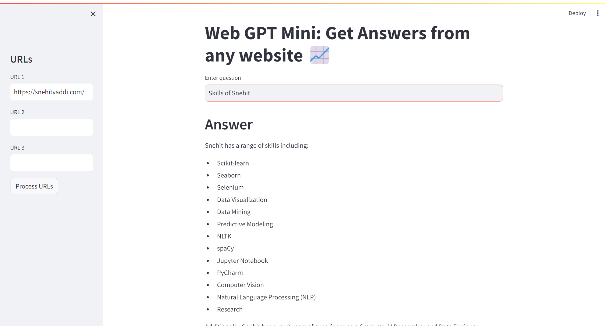

# WebRAG-mini - A URL-Based Question Answering System
WebRAG-mini is a local Streamlit web application that allows users to extract and answer questions from local docuemnts, websites or SQL databases in one place. I developed a strategic control flow pronpt that dynamically selects the most appropriate Large Language Model (LLM) for each question, ensuring accurate and relevant responses. In technical terms it leverages LangChain's document loaders, text splitters, OpenAI embeddings, and FAISS vector stores to provide a seamless question-answering experience. 



## Features

- **Extract Content**: Input URLs and extract content using LangChain's `UnstructuredURLLoader`.
- **Text Splitting**: Split extracted content into manageable chunks with `RecursiveCharacterTextSplitter`.
- **Embeddings**: Generate embeddings using OpenAI's embedding models.
- **Question Answering**: Use a retrieval-augmented generation approach with `RetrievalQAWithSourcesChain` to answer questions based on the extracted content.
- **Source Attribution**: Provides sources for the answers generated.

## Installation

1. Clone the repository:
    ```bash
    git clone https://github.com/snehitvaddi/WebRAG-mini.git
    cd WebRAG-mini
    ```

2. Create and activate a virtual environment:
    ```bash
    python -m venv venv
    source venv/bin/activate   # On Windows: venv\Scripts\activate
    ```

3. Install the required dependencies:
    ```bash
    pip install -r requirements.txt
    ```

4. Create a `.env` file in the root directory and add your OpenAI API key:
    ```
    OPENAI_API_KEY=your_openai_api_key
    ```

## Usage

1. Run the Streamlit application:
    ```bash
    streamlit run WebGenAi.py
    ```

2. Open the application in your browser (usually at `http://localhost:8501`).

3. Input up to three URLs in the sidebar and click "Process URLs".

4. Once the URLs are processed, enter your query in the input box to get answers based on the extracted content.

## Program Flow

```mermaid
graph TD;
    A[Start] --> B[Input URLs]
    B --> |Click 'Process URLs'| C[Load URL Content]
    C --> D[Split Content into Chunks]
    D --> E[Generate Embeddings]
    E --> F[Save Vector Store]
    F --> G[Input Query]
    G --> |Submit Query| H[Load Vector Store]
    H --> I[Retrieve and Answer Question]
    I --> J[Display Answer and Sources]
    J --> K[End]
